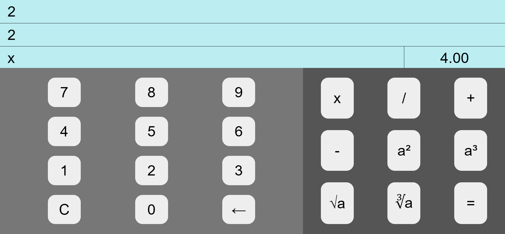

# Calculator

This **calculator** web application, built with React and Redux toolkit, features **_an easy-to-use and interactive user interface_**, which allows users to perform calculations seamlessly on any device with its **_responsive design_**.

# My Pre-Planning of The Project

# Features

Our Simple Calculator application comes packed with a wide range of powerful features that will help you solve calculations with ease. Some of the notable features include:

- The ability to perform multiple operations, including square root, cubic root, squaring, and cubing.
- A handy reset board feature that allows you to start fresh with just one click

## Tools

- React
- Redux toolkit (React-Redux)
- Sass (CSS)
- JavaScript

## Screenshot

## The Demo :

---

## 🚀 About Me

Junior Front-end developer with a history of creating engaging, user-friendly websites with proven success. Developed modern websites with advanced features, showcasing technical excellence. Motivated to stay up-to-date with industry trends and best practices. Aspiring to be a Full-stack developer with a strong determination and passion for coding.

## 🛠 Skills

- HTML/HTML5
- CSS/CSS3
- JavaScript
- Object Oriented Programming (OOP)
- Sass\SCSS
- Pug
- GulpJs
- BootStrap
- Material UI
- React.js
- React ecosystems (React Router - React Redux - React Query)
- Redux - Redux Toolkit
- Firebase

## 🔗 Links

